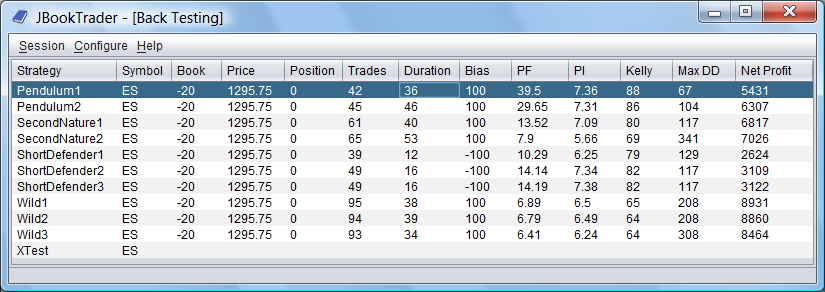
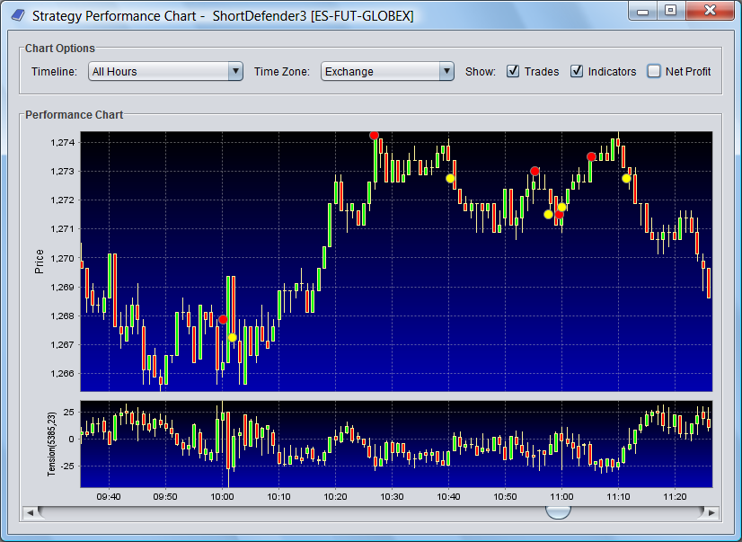
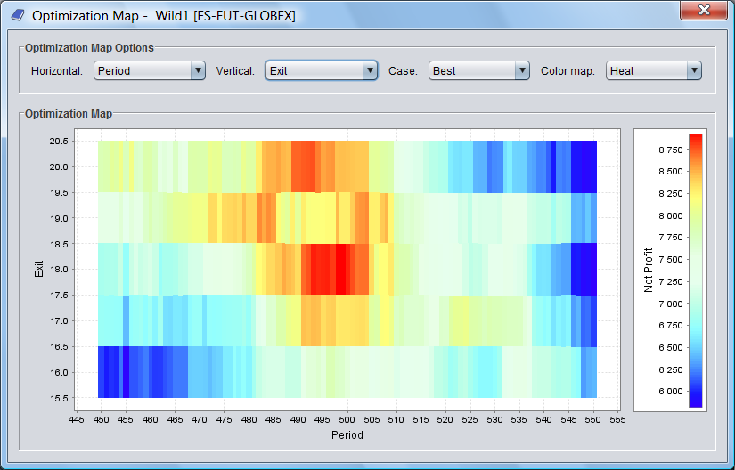

# JBookTrader
Source code of JBookTrader copied from https://code.google.com/archive/p/jbooktrader/.

* `source-archive.zip` was retrieved from https://storage.googleapis.com/google-code-archive-source/v2/code.google.com/jbooktrader/source-archive.zip, which is a link found on https://code.google.com/archive/p/jbooktrader/source/default/source.
    * Version control system used in the zip file's contents: Mercurial.
    * SHA256SUM: 605625726044ab31aa33744b720ea3ef39a207409cfa046afe5c65532f638a77
* The `jbooktrader` directory is `source-archive.zip` unzipped and with the Mercurial files removed.
* `JBookTrader.UserGuide.odt` — JBookTrader User Guide.
    Retrieved from https://docs.google.com/document/d/1uNQzIbuNyNZXxuv9NFCZRgx0nYeEfwuG1ZRfHBnFfZk/edit by clicking on `File > Download > OpenDocument Format (.odt)` to download.
    * SHA256SUM: 0c15a20afa038a0cc9d59c1ed4c31851815f639d6ae0b0c7d2a5bb8d93e7885a
* `JBookTrader.UserGuide.pdf` — Same as `JBookTrader.UserGuide.odt`, but in PDF format.
    Retrieved from https://docs.google.com/document/d/1uNQzIbuNyNZXxuv9NFCZRgx0nYeEfwuG1ZRfHBnFfZk/edit by clicking on `File > Download > PDF Document (.pdf)` to download.
    * SHA256SUM: 0f2c0e075b754ad6d01b7b6a05f8f7e0b0090195f9df0d738e578e4d919c54a2

## Project description
JBookTrader is a fully automated trading system (ATS) that can trade various types of market securities during the trading day without user monitoring. All aspects of trading, such as obtaining market prices, analyzing price patterns, making trading decisions, placing orders, monitoring order executions, and controlling the risk are automated according to the user preferences. The central idea behind JBookTrader is to completely remove emotions from trading, so that the trading system can systematically and consistently follow a predefined set of rules.

The features include strategy back testing, optimization, market data recording, and real time trading via the Interactive Brokers API.

JBookTrader is written in Java and is intended for software developers. It is not an "off-the-shelf" product that can be installed and run. Instead, JBookTrader provides a framework for developing automated trading systems and requires a certain amount of programming knowledge and experience in Java. If you are not a software developer or if you don't have much experience programming in Java, JBookTrader is probably not for you.

Before you start working with JBookTrader, please read the [JBookTrader User Guide](./JBookTrader.UserGuide.pdf) and the documents located in the /docs directory of the distribution.

## License
[New BSD License](https://opensource.org/licenses/BSD-3-Clause)
